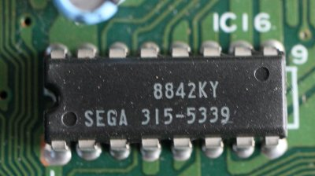
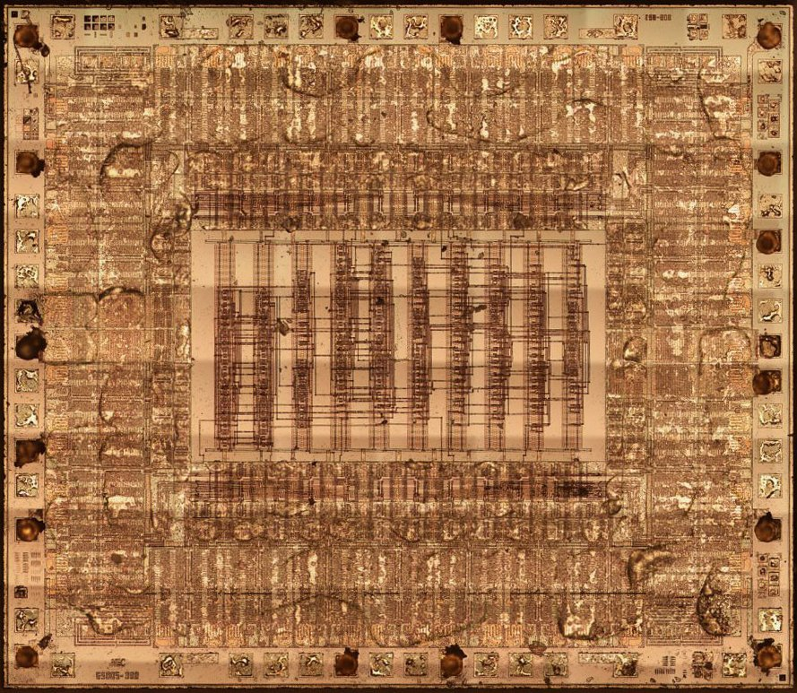

# EDCLK generator & work RAM fix

## 74-series logic
Used in MD1VA0.

TBD.

## Sega 315-5339

Used in MD1VA1. Probably equivalent to MD1VA0.

- NEC 65005-302
- ULA is used
- Two metal layers
- Pockets are always on the right

https://drive.google.com/drive/u/0/folders/19Mp-eKXWyN-YTMmKZN7sT4CFiTHb6Ubb

TBD.

## Sega 315-5345
Used in MD1VA2, fixes some work RAM issue.

TBD.

## Yamaha YM6045C & onward
YM6045C integrates these fixes. Probably equivalent to MD1VA2.

TBD.
