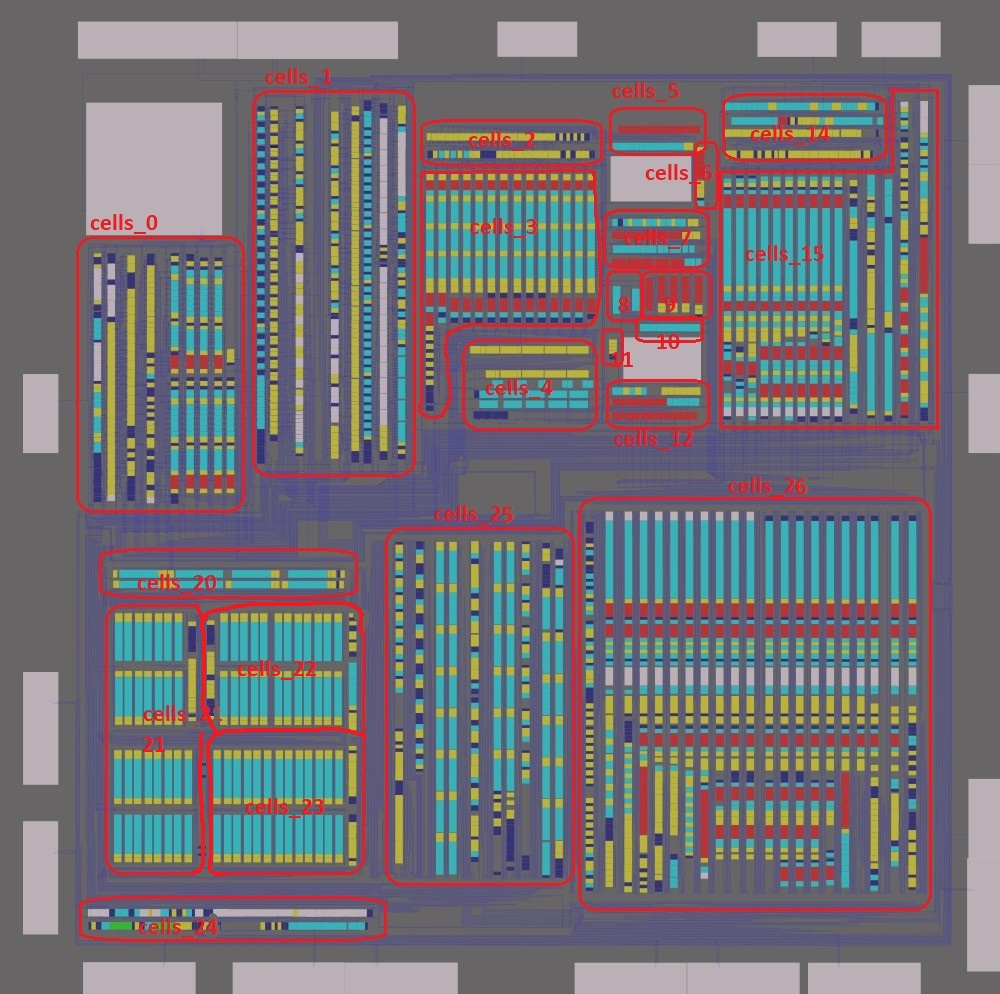

# By Cells

Топология распиленная на домены ячеек, для автоматической обработки оных.

Домены ячеек:

(выбраны в произвольном порядке, с учётом ориентации ячеек - горизонтально или вертикально)

## Что тут делается

Изначально на мастер датасете ячейки были размечены просто квадратами.

Нужно:
- Дать ячейкам типы. Для этого отдельно есть TXT файлы с типами по доменам.
- Дать ячейкам ориентацию (TBD)  `nukeykt — Сегодня, в 12:32 - пока ident сделай, потом в json буду править и смотреть`
- Составить базу ячеек и разметить им размеры (W/H) и порты. Разметка производится для ориентации Ident
- Все ячейки распилены на домены - из общего исходного XMLZ получилось много мелких XMLZ соответствующим TXT
- Используя базу ячеек (с размерами и портами) и plain TXT файлы + какой-то файл с ориентацией ячеек - сгенерировать JSON для скрипта Cells.py
- Натравить скрипт Cells.py на каждый мелкий XMLZ, чтобы он автоматически расставил типы ячеек, имена, подровнял размеры и добавил порты (виасы)
- Объединить все полученные мелкие XMLZ с именами и портами в один общий XMLZ
- Из исходного общего XMLZ (который в папке выше) - удалить все старые ячейки и импортировать общий XMLZ полученный обработкой выше

Таким образом получим общий XMLZ с ячейками и их портами, к которым затем нужно (руками?) пришнуровать обрубки.
