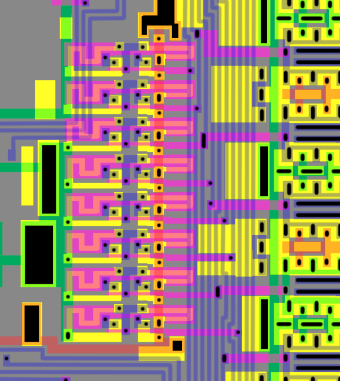
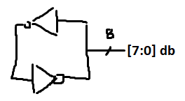

# regblock

## Cells

## Databus Keepers

это баскиперы на шину данных, прям трушные.

## Databus IO

Содержит довольно странный Bufif1:

|d|ena|q|
|---|---|---|
|0|0|0 -- тут странно |
|1|0|z|
|0|1|0|
|1|1|1|

TBD: Транзисторная схема картинка.

это выход с регистров на шину данных такой, уже декомплементированный в 1 шнурок.

## Regs1 SRAM Array

я назову их r0 .... rN слева направо чтобы как-то ссылаться
потом табличку сделаю ху из ху

## Regs2 SRAM Array

## IDU Possibly

## IDU Carry Lookahead Possibly

## Addressbus Latch

