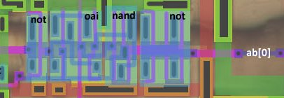

# regblock

## Top Aux Logic

## Cells

## Databus Keepers

Левее regblock находятся канонические [бас киперы](https://en.wikipedia.org/wiki/Bus-holder) для шины данных.

## HI Part Demux to ALU

## Databus IO

Содержит довольно странный Bufif1:

|d|ena|q|
|---|---|---|
|0|0|0 -- тут странно |
|1|0|z|
|0|1|0|
|1|1|1|

TBD: Транзисторная схема картинка.

это выход с регистров на шину данных такой, уже декомплементированный в 1 шнурок.

Databus IO <-> Regs1 Bridge:

## Regs1 SRAM Array

я назову их r0 .... rN слева направо чтобы как-то ссылаться
потом табличку сделаю ху из ху

Regs1 <-> Regs2 Bridge:

## Regs2 SRAM Array

Regs2 <-> IDU Bridge:

## IDU Possibly

## IDU Carry Lookahead Possibly

## Addressbus Latch

