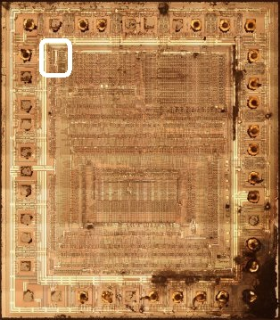
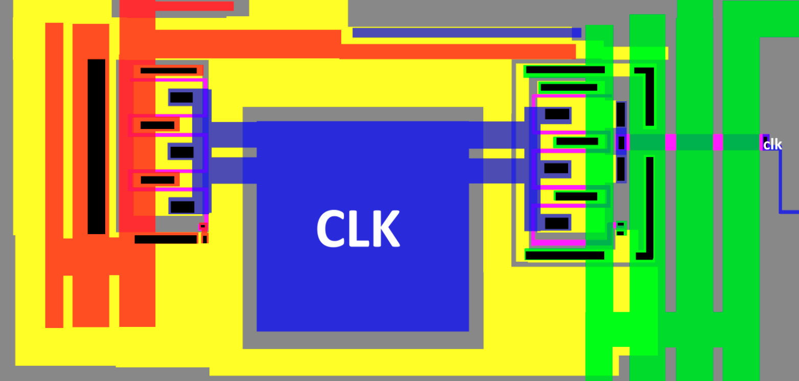
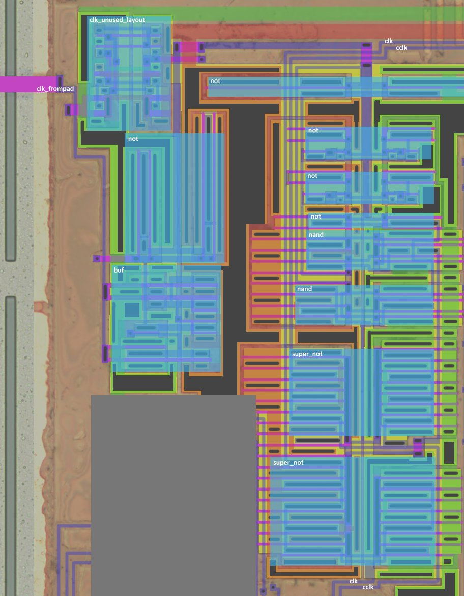
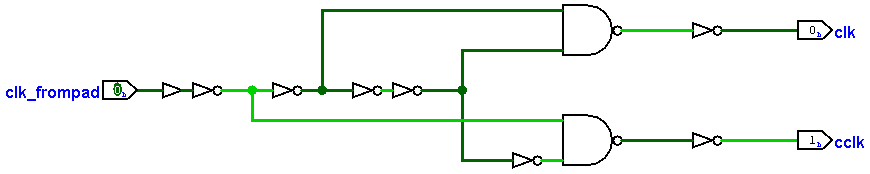

# ClkGen

## CLK Pad

Non-inverting pad with diode protection (?)

## Clock Generator

|Signal|From/Where to|Description|
|---|---|---|
|clk_frompad|From the CLK pad | Input CLK |
|clk|all over the chip | CLK inside the chip |
|cclk|all over the chip |Complement for clk|

