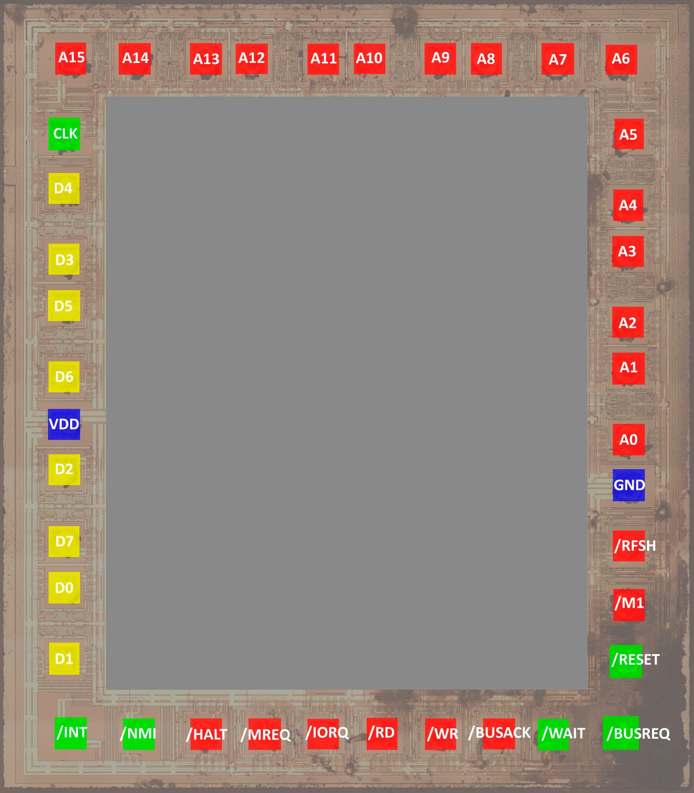

# Pinout & Pads

|Pin/Pad|Direction|Description|
|---|---|---|
|D0-D7 |Input/output 3-state |The 8-bit bi-directional data bus. |
|A0-A15 |Output 3-state |The 16-bit address bus. These pins specify memory and I/O port addresses. During a refresh cycle, the refresh address is output. |
|/M1 |Output |The Machine Cycle 1 signal. In an operation code fetch cycle, this pin goes "0" with the /MREQ signal. At the execution of a 2-byte operation code, this pin goes "0" for each operation code fetch. In a maskable interrupt acknowledge cycle, this pin goes "0" with the /IORQ signal. |
|/RD |Output 3-state |The Read signal. It indicates that the MPU is ready for accepting data from memory or I/O device. The data from the addressed memory or I/O devices is gated by this signal onto the MPU data bus.|
|/WR |Output 3-state |The Write signal. This signal is output when the  data to be stored in the addressed memory or I/O device is on the data bus.|
|/MREQ |Output 3-state |The Memory Request signal. When the execution address for memory access is on the address bus, this pin goes "0" . During a memory refresh cycle, this pin also goes "0" with /RFSH signal.|
|/IORQ |Output 3-state |The Input/Output Request signal. This pin goes "0" when the address for an I/O read or write operation is on the low-order 8 bits (AO through A7) of the address bus. The /IORQ signal is also output with the /M1 signal at interrupt acknowledge to tell an I/O device that the interrupt response vector can be placed on the data bus. |
|CLK |Input |The Single-phase Clock Input. When the clock input is placed in the DC state (continued "1" or "0" level). this pin stops operating and holds the state of that time. |
|/RESET |Input |The Reset signal input. /RESET signal is used for initialization MPU and must be kept in active state ("0") for a period of at least 3 clocks. |
|/INT |Input |The Maskable Interrupt signal. An interrupt is caused by the peripheral LSI. An interrupt is acknowledged when the interrupt enable flip-flop (IFF) is set to" 1" by software. The /INT pin is normally wire-ORed and requires an external pullup resistorforthese applications. |
|/WAIT |Input |The Wait Request signal. This signal indicates to the MPU that the addressed memory or I/O device is not ready for data transfer. As long as this signal is "0", the MPU is in the Wait state.|
|/BUSREQ |Input |The bus Request signal. The /BUSREQ signal forces the MPU address bus, data bus, and control signals /MREQ, /IORQ, /RD, and /WR to be placed in the high-impedance state. This signal is normally Wire-ORed and requires an external pullup resistor for these applications|
|/BUSACK |Output |The Bus Acknowledge signal. In response to the /BUSREQ signal, the /BUSACK signal indicates to the requesting peripheral LSI that the MPU address bus, data bus, and control signals /MREQ, /IORQ, /RD and /WR have been put in the high-impedance state. |
|/HALT |Output |The Halt signal. This pin goes "0" when the MPU has executed a Halt instruction and is in the Halt state.|
|/RFSH |Output |The refresh signal. When the dynamic memory refresh address is on the low-order 8 bits of the address bus, this signal goes "0" . At the same time, the /MREQ signal also goes active ("0"). |
|/NMI |Input |The Non-maskable Interrupt Request signal. This interrupt request has a higher priority than the maskable interrupt and is not dependent on the interrupt enable flip-flop (IFF) state. |
