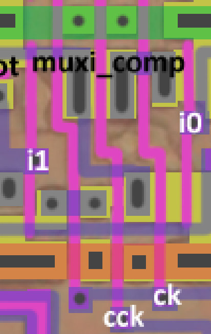
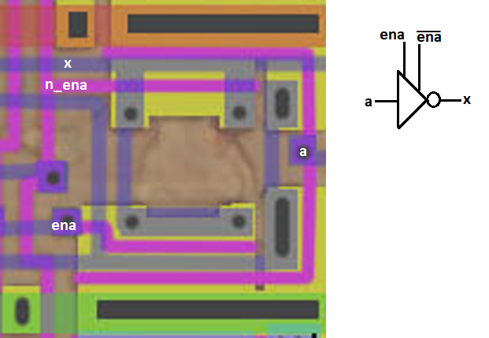

# Нестандартные ячейки TOSHIBA Z80 MPU

В основном всё просто, но попадаются "экземпляры", которые могут быть непривычны тем кто много не реверсил "антиквариат".

Напоминаю, что ряды ячеек хоть и выглядят ровными, но составлены не из стандартных (одинаковых) ячеек, хотя и не сильно различающихся. Поэтому мы называем их "нестандартные" ячейки.

## muxi_comp

Инвертирующий мультиплексор с dual-rail CLK.

Такая ячейка часто использутся в старых чипах, где CLK разводится по ячейкам двумя комплементарными шнурками (ck + cck).

В ячейке применяется пред-инвертирование для каждого из входов i0/i1, поэтому выход с любого "плеча" будет инвертирован. Но иногда попадаются "мухи", когда один из входов пред-инвертирован, а второй - нет. Надеюсь такого тут не попадётся, но нужно быть готовым.

## inv_tris_comp

Инвертирующий тристейт буфер с комплементарным enable.

Ещё один антикварный экспонат, в качестве enable используются 2 комплементарных шланга, на каждую из N/P половин ячейки. По сути является "половинчатым" инвертирующим мультиплексором, рассмотренным выше (входное значение также пред-инвертируется прежде чем пройти через pass-gate FET-ы).
Такие тристейты можно часто встретить в старых чипах.
В более современных чипах чаще встречаются тристейты, которые уже внутри получают комплемент для единственного разрешающего входа (in-place).
