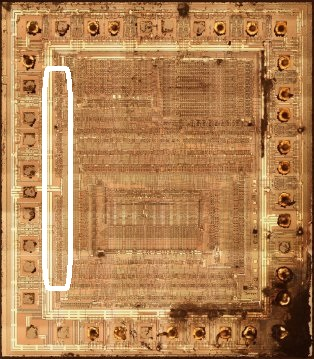
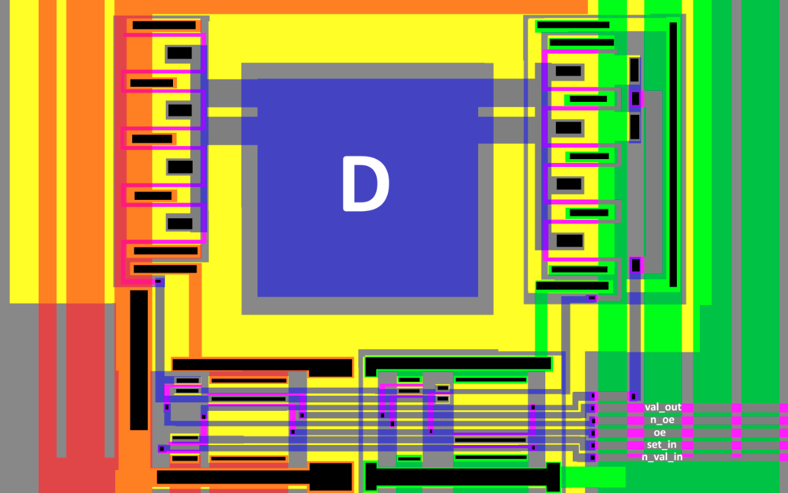
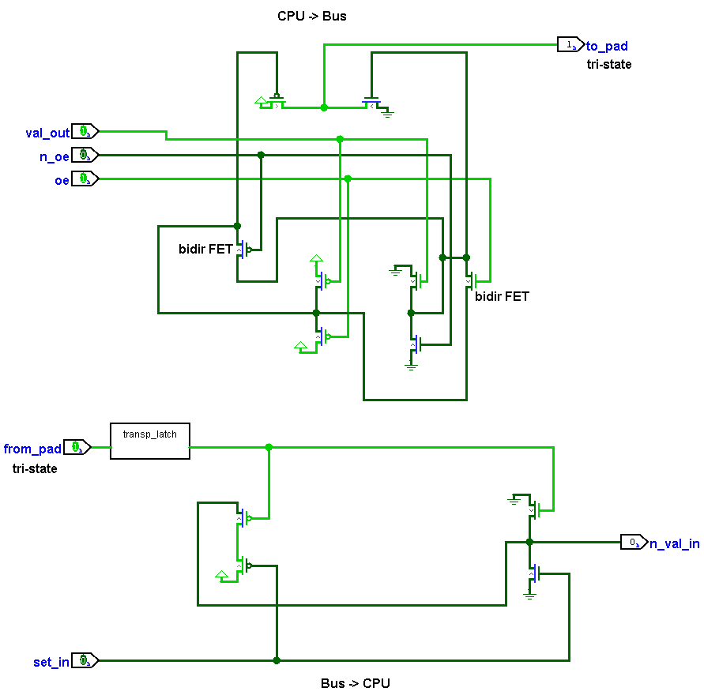
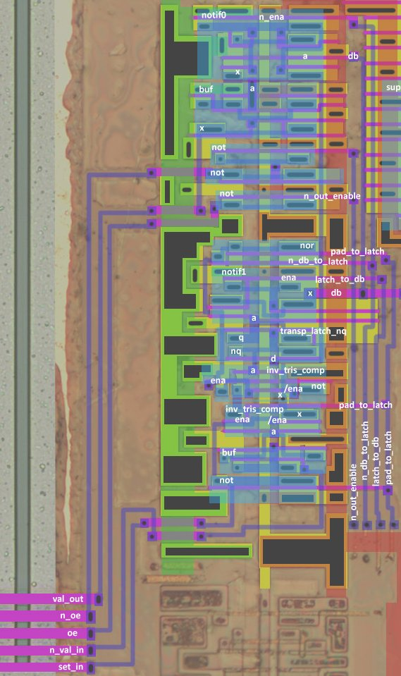
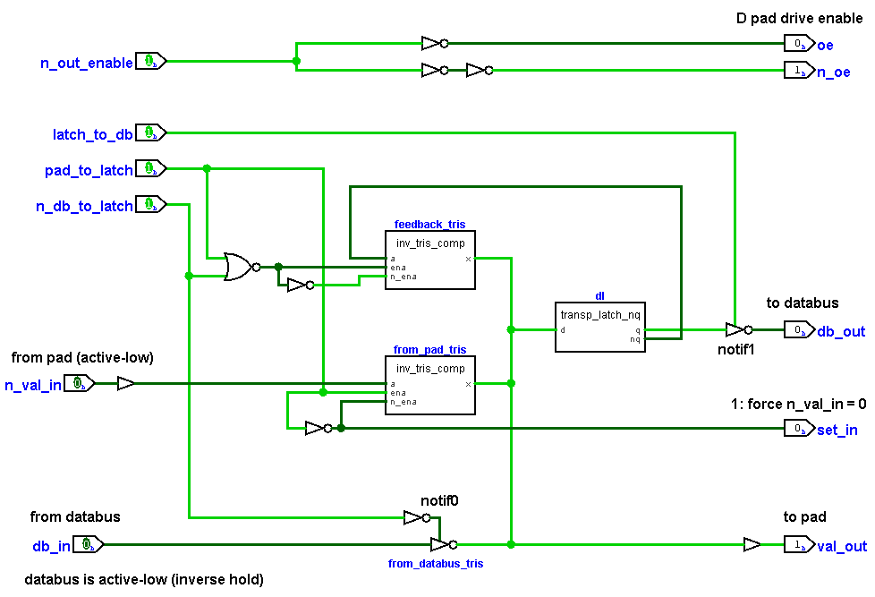

# External Databus I/F

:warning: Жирное примечание. Внутренняя шина данных (шд) использует inverse-hold хранение значения. То есть 0x00 на шине - это по сути 0xFF.

## External Databus Pad

К сожалению, Logisim не поддерживает bidir транзисторы, поэтому работа вЫходной схемы (CPU -> Bus) показана для варианта, когда транизисторы работают в нужную сторону.

Выходная схема представляет собой по сути Bufif1 с комплементарным входом управления (oe + /oe).

Входная схема (Bus -> CPU) это обычный nor, но с небольшой поправкой что один вход nor-a приходит из tri-state входного пада, поэтому может "плавать" и хранится на затворе FET. Для имитации достаточно тыкнуть transparent latch.

Сигнал `set_in`=1 устанавливает вход n_val_in в 0 (то есть по сути в 1, т.к. вход в инверсной логике). Опять грёбаная инверсная-инверсная логика, будьте внимательны.

## Databus I/F

|Сигнал|Откуда/Куда|Описание|
|---|---|---|
|val_out|на пад|Выход на пад |
|oe|на пад|1: Output enable. Задрайвить пад внешней шины данных|
|n_oe|на пад|Комплемент oe |
|n_val_in|с пада|Вход с пада (active low) |
|set_in|на пад|Сделать n_val_in = 0 (входное значение = 1)|
|n_out_enable|с логики управления DataBus|Из этого сигнала получается 2 комплементных oe+/oe|
|db_to_latch|с логики управления DataBus| Внутренняя Databus -> Data Latch|
|latch_to_db|с логики управления DataBus| Data Latch -> Внутренняя Databus |
|pad_to_latch|с логики управления DataBus| Pad -> Data Latch;  Если неактивны все сигналы x -> y, то DataLatch заколцовывается сам на себя (FF) |
|db| |Внутренняя шина данных |

Features:
- Содержит прозрачную защёлку, которую принято называть просто "datalatch" (dl)
- Защёлка dl получает на вход дерево из 3 тристейтов:
	- Если активен сигнал pad_to_latch, то значение с пада 
	- Если активен сигнал db_to_latch, то значение с внутренней шд
	- Если не активны вышеуказанные сигналы, то защёлка фидит сама себя, таким образом формируя flip flop
- Значение с дерева тристейтов (которое всегда драйвится по соглашению) также выдаётся обратно на пад (val_out), а также по требованию (latch_to_db) с защёлки dl на внутреннюю шд
- Драйв пада D контролируется сигналом n_out_enable=0, формируя комплементы oe+/oe
