# Regblock

Официальное обозначение этого модуля - `Register Array`. Но мы будем использовать более употребительный термин "регблок".

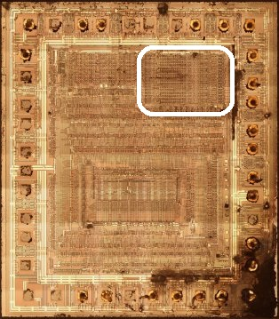

(на маске показан регблок и окружающие его элементы схемы - бас киперы, ячейки управления регблоком)

## Сигналы

|Сигнал|Откуда/Куда|Описание|
|---|---|---|
|clk|ClkGen, по всему чипу | TBD. Используется в верхней вспомогательной логике, в ячейках для обслуживания регблока |
|cclk|ClkGen, по всему чипу |Комплемент clk. Используется в ячейках для обслуживания регблока |
|db \[7:0\]| |Внутренняя шина данных|
|ab \[15:0\]| |Шина адреса для падов |
|regs_to_db|From Regs Control |Regs1 -> Databus |
|db_to_regs|From Regs Control |Databus -> Regs1 |
|n_db_to_regs|From Regs Control |Комплемент db_to_regs|
|n_pch_bl|From Regs Control |0: Bit Line precharge для Regs1/Regs2. Подзарядка bitline шлангов перед актуализацией их значения|
|wl \[13:0\]|From Regs Control |Word Line enable для регистра с соответствующим индексом|
|regs1_to_regs2|From Regs Control |Regs1 <-> Regs2. Для соединения используется "любимый всеми" элемент `tran` (двунаправленный элемент соединения двух шин)|
|n_regs1_to_regs2|From Regs Control |Комплемент regs1_to_regs2|
|idu_to_regs2|From Regs Control |IDU -> Regs2|
|n_idu_to_regs2|From Regs Control |Комплемент idu_to_regs2|
|idu_ck| |ck=0: Сохранить результат операции на IDU в Slave FF|
|idu_cck| |Комплемент ck|
|idu_ck2| |ck2=0: Загрузить входное значение в IDU Master FF с регистров|
|idu_cck2| |Комплемент ck2|
|n_idu_clr| |0: Установить выход IDU в 0 независимо от результатов вычислений (Note: выход IDU в инверсной логике и этот управляющий сигнал тоже в инверсной логике, грёбаные неформалы.. То есть когда этот n_idu_clr=0 - выход равен 1 (инверсное значение 0). Будьте внимательны)|
|idu_carry_out| |Пока хз|
|to_idu_carry1| |Пока хз|
|to_idu_carry2| |Пока хз|
|idu_carry_in| |Пока хз|
|ci \[15:0\]|IDU FF -> CLA |Внутренний сигнал. Выход значения входного IDU FF в CLA |
|co \[15:0\]|CLA -> IDU FF |Внутренний сигнал. Результат вычисления CLA для IDU_FF XNOR |
|xi \[15:0\]|IDU FF -> IDU XOR|Внутренний сигнал. Выход значения входного IDU FF в правый XOR|
|xo \[15:0\]|IDU XOR -> CLA |Внутренний сигнал. Выход с правого XOR в CLA|

## Верхняя вспомогательная логика (Top Aux Logic)

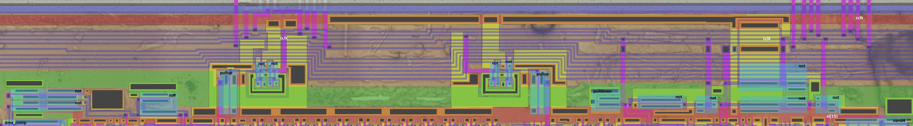

В основном эта часть отвечает за динамическую логику (подзарядку бит лайнов напр.), а также задаёт тайминги и ограничения интерконнектов между всеми кусками регблока.

Features слева-направо в топологическом порядке:
- 2 not + not: TBD
- По середине находятся 2 pullup, которые открываются когда clk = 0. В это время подзаряжаются бит лайны для Regs1 и Regs2, поэтому пользоваться ими в это время нельзя
- pulldown: TBD
- not+not: TBD
- not, not+not: TBD

## Нестандартные ячейки для обслуживания регблока (Cells)

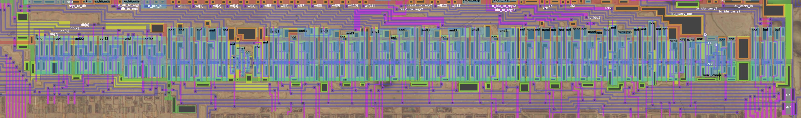

В состав входит нецифровая ячейка, которая растягивает нижний уровень входного CLK и инвертирует фронт (используется для формирования сигнала `n_pch_bl`):

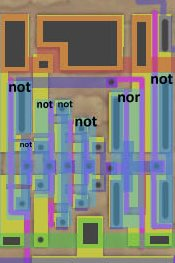

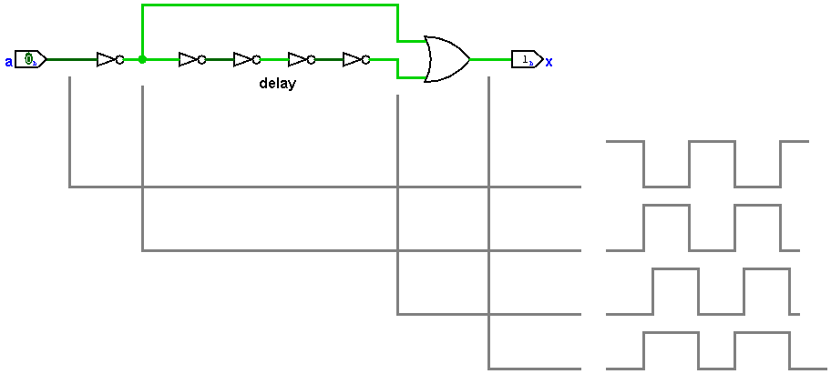

Изучать эти ячейки для управления регблоком пока не будем, т.к. на вход к ним поступает овер дохера неизвестных инпутов, скорее всего с декодера или секвенсера.
Идея была узнать порты регблока изучив эти ячейки (снаружи-внутрь), но оказалось что порты регблока изучились изнутри-снаружу и потребности в ячейках пока нет.

Отдельно хочется отметить, что в левой части ряда затесалось несколько ячеек CondLogic (немного aoi+входы с шины данных), которая тоже пока за доменом исследований.

## Databus Keepers

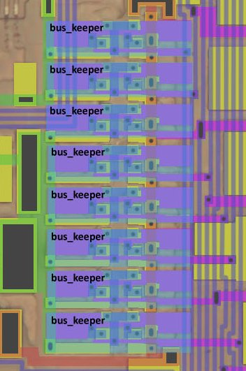

Левее regblock находятся канонические [бас киперы](https://en.wikipedia.org/wiki/Bus-holder) для шины данных. Тоже затесались в регблок случайно, напрямую к нему не относятся. Просто разработчики решили приткнуть их там где место было.

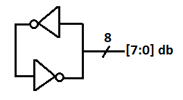

## Демультиплексор для Старшего значения регистров для DB/ALU (HI Part Demux to ALU)

Используется чтобы выбрать направление куда выдавать значение со старшей части регистров: На АЛУ или на шину данных. Также к регблоку не имеет особо отношения, т.к. выбор направления происходит из АЛУ-части.

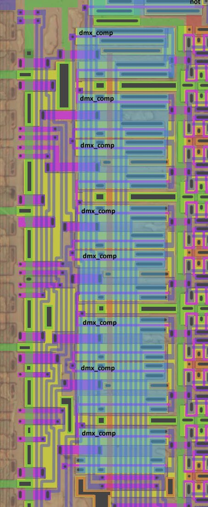

## Databus IO

Выход с регистров на шину данных, уже декомплементированный в 1 провод. Младшая половина регистров сразу соединяется с шиной данных. Старшая половина соединяется через демультиплексор. Но для рассмотрения регблока можно считать что данные просто "куда-то выходят".

:warning: nand имеет динамическую память на затворе (DLatch), т.к. вход его может плавать, т.к. является выходом тристейта (для имитации достаточно тыкнуть transparent latch на входе)

Содержит довольно странный Bufif1:

|d|ena|q|
|---|---|---|
|0|0|0 -- тут странно (TBD: разобраться в чём дело) |
|1|0|z|
|0|1|0|
|1|1|1|

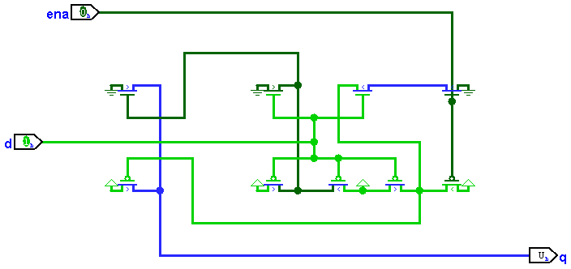

Мостик между Databus IO и регистрами1 (Databus IO <-> Regs1 Bridge):

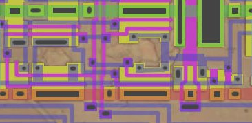

:warning: Правый тристейт имеет динамическую память на затворе (DLatch), т.к. вход его это выход левого тристейта, который может "отвалиться" и сделать вход правого тристейта "плавающим".

## Regs1 SRAM Array

Ячейки регистров представляют собой типовые 6T-Sram Cell с комплементарным InOut bitline (`bl` + `bl_bar`). Вместо использования Sense Amp применяется олдскульная техника подзарядки bitline (Precharge).

Договоримся нумеровать регистры от 0 до N слева направо, когда будет известно больше будет добавлена табличка для сопоставления номера регистра и его привычного названия (A, B, C итд.)

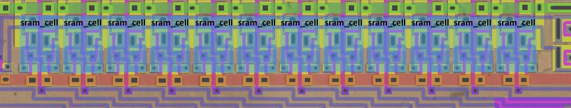

Мостик между регистрами1 и регистрами2 (Regs1 <-> Regs2 Bridge):

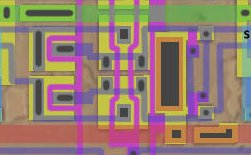

## Regs2 SRAM Array

Кроме основного блока регистров также имеется маленький "блочок" из двух регистров.
Текущая гипотеза (по аналогии с NMOS) - это регистры IR и PC. Какой из них I+R, а какой PC - пока не понятно.

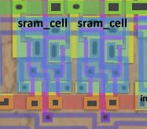

Мостик между регистрами2 и IDU (Regs2 <-> IDU Bridge):

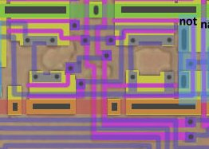

## Increment/Decrement Unit (IDU) Flip/Flop

В процессоре Z80 АЛУ не занимается операцией инкремента/декремента, вместо этого в регблоке присутствует данная схема, как раз для операции +1/-1 над регистрами.
Удобство заключается также в том, что значение с IDU можно сразу выдать на шину адреса (например, для PC).

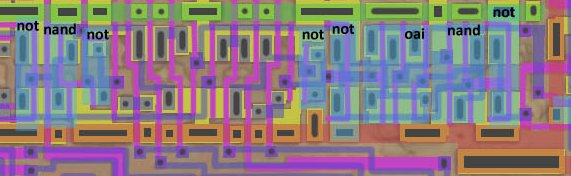

:warning: Правый мух имеет динамическую память на затворе (DLatch), т.к. вход его может плавать (для имитации достаточно тыкнуть transparent latch на входе)

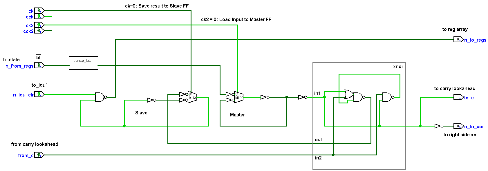

Основная часть IDU включает в себя:
- Master FF для загрузки значения с регистров
- Slave FF для хранения результата операции на IDU и выдачи значения обратно на регистры
- Элемент пересчёта (XNOR)

## IDU Carry Lookahead

Для оптимизации переноса - его вычисление производится "параллельно" со значениями разрядов (снаружи). Для этого используется данная Lookahead логика.

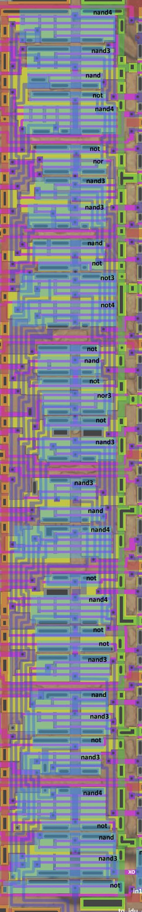

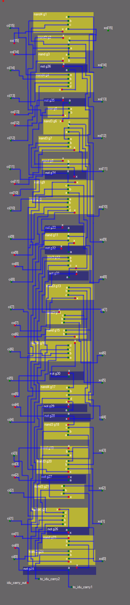

## IDU XOR + Address SuperInv

Содержит элемент пересчёта (XOR), а также суперинвертор для выдачи значения для внешней шины адреса (ab\[15:0\]), которое уходит сразу на пады.

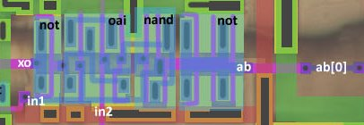

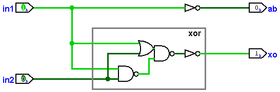

XOR cодержит такой OAI:

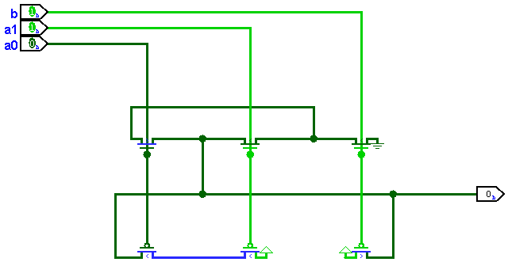
