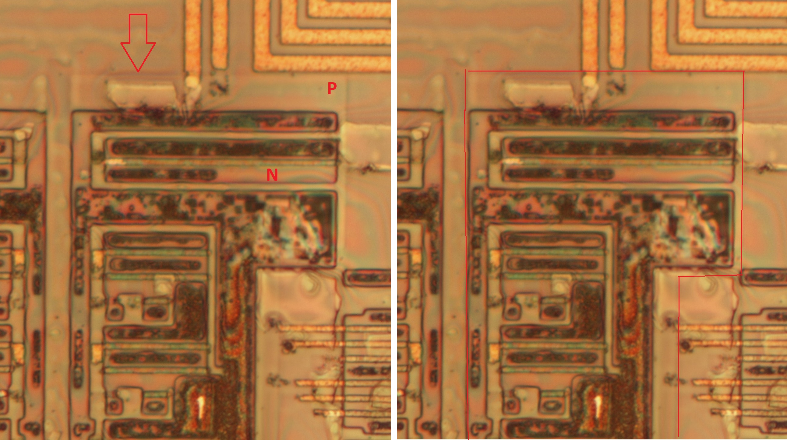
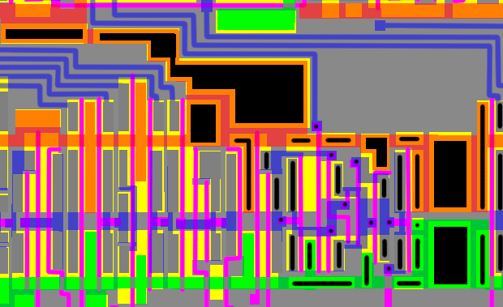
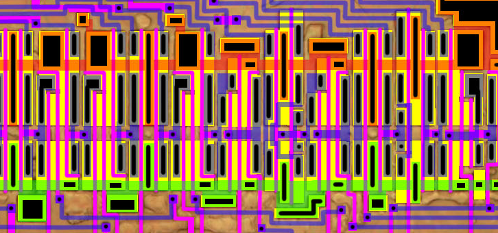
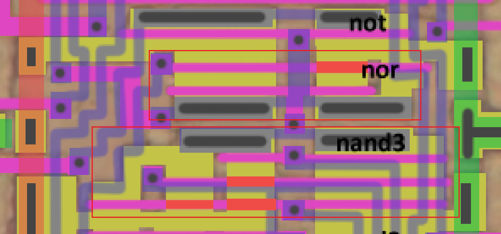

# Заметки по топологии

В данном разделе коллекция примечательных фич топологии изучаемой микросхемы.

## Карманы

P-карманы для N-типа.

## Виасы

дыроколом походу ещё не научились заливать. сплошными полигонами заливают

## Нестандартные ячейки

На первый взгляд кажется что ряды составлены из стандартных ячеек. Но на самом деле они "нестандартные" и тоже являются кастомным дизайном:

## Деактивированные затворы

Неизвестно, какая технология используется для деактивации затворов, предположительно просто утолщение подзатворного диэлектрика.

На картинке представлены 2 вентиля. Места, где находятся деактивированные затворы, помечены оранжево-красноватым цветом.

В целом, можно догадаться где затворы пропущены, т.к. разработчики сделали особенным образом диффузию в таких местах (в виде дырок или вырезов).

Деактивируются либо P-транзисторы, либо N-транзисторы. Причём такой способ применяется не только в нестандартных ячейках, но также и в блоках с кастомным дизайном (например в декодере вся нижняя P-часть сделана именно так).

