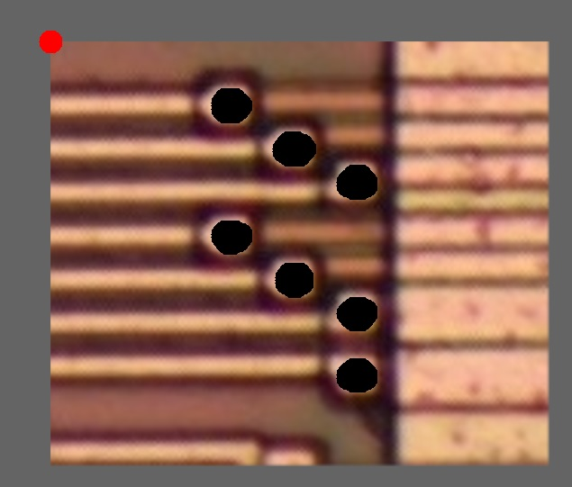

# Нейросети для дероутинга VDP

## VDP_Neural_1

Первая версия нейросети, кривоватая. Пока более-менее находит только виасы.

## test

Тестовый набор данных, для проверки распознавания проводов и виасов

## test_vias

Тестовый набор (мелкий), для быстрой проверки распознавания виасов.

## Как использовать

- Запустить Deroute
- Загрузить исходную картинку (File -> Load Image) 
- Кнопку с мозгом -> Load Model -> VDP_Neural.xml
- Для обучения: Кнопку с мозгом -> Train Model -> Save Model (после обучения)
- Для запуска нейросети: Кнопку с мозгом -> Run Model

Можно оставить только все виасы после распознавания:
- Selection -> Select all wires -> Del

Можно оставить только провода:
- Selection -> Select all viases -> Del

Пока всё работает криво. Сущности наползают друг на друга, дероут иногда падает. Нужно пинать орга, чтобы он починил.

Если упало, то можно попытаться сохранить куда-то нетлист и после перезапуска Deroute снова загрузить его.

## Зал славы

Выкладываем тут успехи нейросети.

