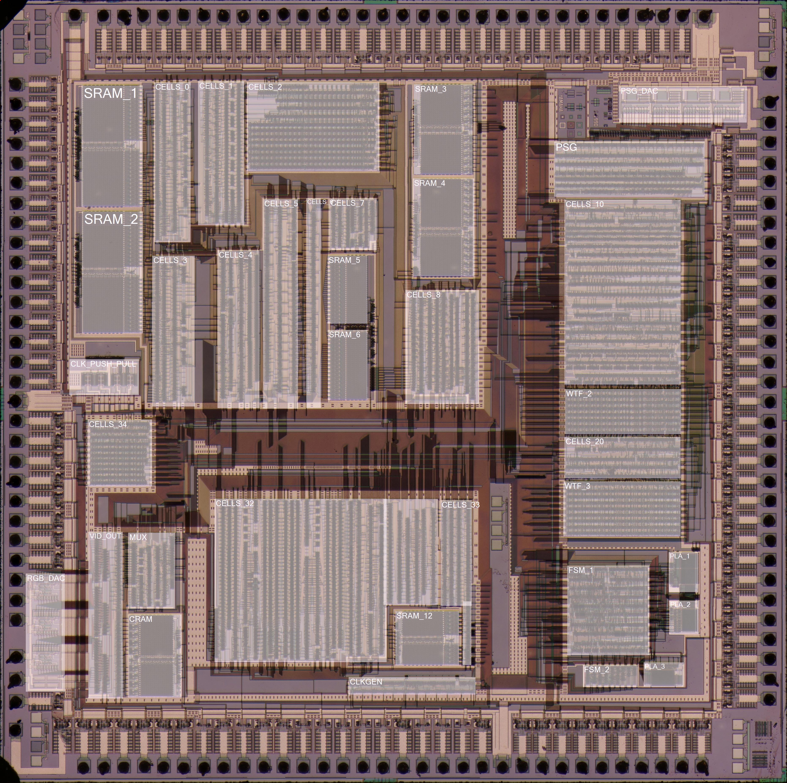

# VDP

Раздел для VDP

```
nukeykt — Сегодня, в 11:49
года полтора назад пробовал)
```

Маркировка VDP: первый был YM7101 (YAMAHA) потом FC1001 (тоже ямаха, они где то с 1990 чипы по другому обзывать начали).

Тут какая-то картинка с результатами ковыряния @nukeykt:, потом заменится на раздел "Модули". Но тут есть контакты. ВОзможно картинка станет разделом "Терминалы".


## Модули VDP

Пока ещё не известны назначения всех модулей.



|Модуль|Назначение|
|---|---|
|Верхняя часть||
|SRAM_1| Sprite linebuffer |
|SRAM_2| Sprite linebuffer |
|SRAM_3| Sprite attribution table |
|SRAM_4| Sprite attribution table |
|SRAM_5| Current line sprites attributes |
|SRAM_6| Current line sprites attributes |
|CELLS_0| Sprite logic |
|CELLS_1| Sprite logic |
|CELLS_2| Current line sprites list |
|CELLS_3| Sprite logic |
|CELLS_4| Sprite logic |
|CELLS_5| Sprite logic |
|CELLS_6| Sprite logic |
|CELLS_7| Sprite logic |
|CELLS_8| Collects all sprites in line |
|WTF_1| Clock |
|PSG_DAC| |
|PSG| |
|CELLS_10| Registers logic, DMA logic, etc |
|WTF_2|  |
|CELLS_20| |
|WTF_3| Command FIFO ? |
|Нижняя часть||
|RGB_DAC| |
|CELLS_30| DAC logic |
|CELLS_31| Combines planes and sprite layers |
|CELLS_32| Plane rendering |
|CELLS_33| Plane rendering |
|SRAM_10| VRAM logic |
|SRAM_11| Color RAM |
|SRAM_12| Vertical Scroll RAM |
|CLKGEN| |
|FSM_1| |
|FSM_2| |
|PLA_1| |
|PLA_2| |
|PLA_3| |

Реверсим.
