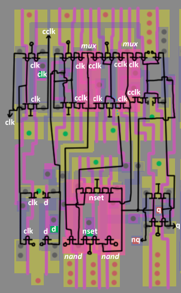
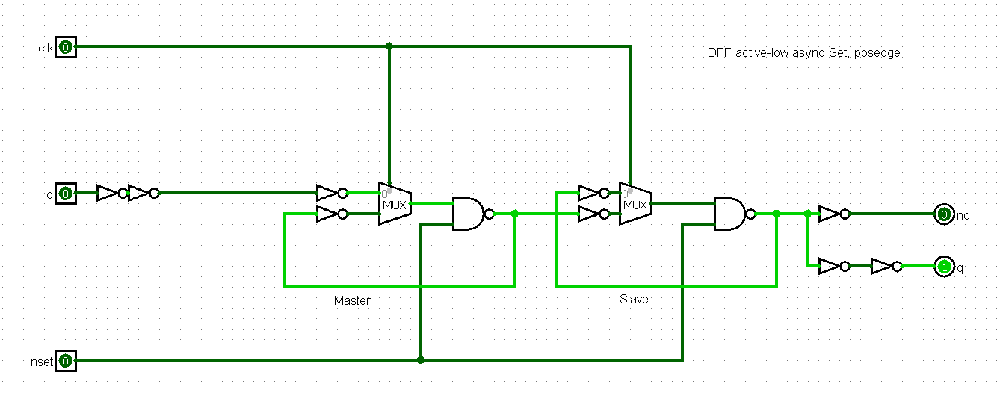
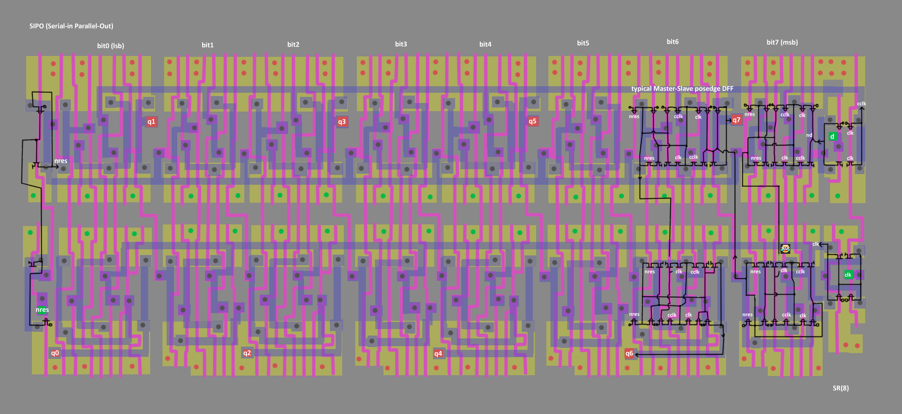
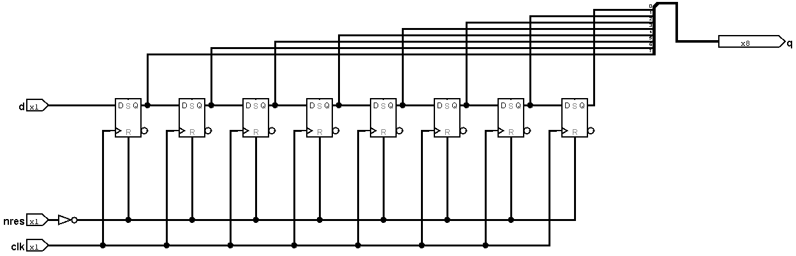
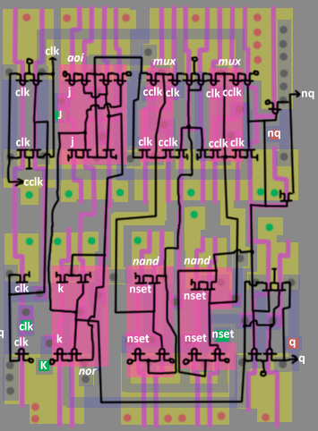

# Стандартные ячейки YM6

Библиотека стандартных ячеек, применяемых в CMOS чипах Yamaha серии YM6xxx.

Благодаря тому, что ячейки устроены "двухэтажно" (по середине земля, по краям VDD) - группа симметрии ячеек упрощенная. Ячейку можно всего-лишь "флипать" слева-направо (по горизонтали). Название группы когда там можно делать только "тудым-сюдым" не помню, вроде `Z(2)`.

На кислотных картинках с трансами зелёными и красными квадратами отмечены места соединения внутренних кишков M1 с вшеншними "сосиськами" M2 (зелёные квадраты - input, красные квадраты - output).

## Ячейка 1 - not

|||||
|---|---|---|---|

## Ячейка 2 - dffrpos

DFF по нарастающему фронту (posedge) с инверсным сбросом (#RES).

|||||||
|---|---|---|---|---|---|

## Ячейка 3 - nand4

||||
|---|---|---|

## Ячейка 4 - nand3

||||||
|---|---|---|---|---|

## Ячейка 5 - nand
||||||
|---|---|---|---|---|

## Ячейка 6 - and

|||||
|---|---|---|---|

## Ячейка 7 - buf

||||||
|---|---|---|---|---|

## Ячейка 8 - nor

||||
|---|---|---|

## Ячейка 9 - DFF, active low async Set, posedge (`dffspos`)

Regular posedge Master-Slave DFF with active-low set input. Nothing unusual.

|||
|---|---|

## Ячейка 10 - or

|||||
|---|---|---|---|

## Ячейка 11 - GND
|||||
|---|---|---|---|

## Ячейка 12 - nor3

||||
|---|---|---|

## Ячейка 13 - VDD
|||||
|---|---|---|---|

## Ячейка 14 - cnt_bit
||||||
|---|---|---|---|---|

Разряд синхронного счётчика.

(CLK тут на картинке - это на самом деле ld = Load)

(часть инверторов на логической схеме элиминирована и вошла в состав mux).

Конструкция слева с участием входного carry и старого значения - это извращенный xnor:

## Ячейка 15 - and3

|||
|---|---|

## Ячейка 16 - strong_buf

||||
|---|---|---|

## Ячейка 17 - 8bit SIPO Shift Register (sr8) + Async Reset

Typical shift register. Features:
- The register bits are based on a typical Master-Slave posedge DFF, with an inverter each on the input and output (these can be omitted for analysis)
- Reset is asynchronous (not tied to CLK)
- Reset input in inverse polarity (#RES)

Occurs in the Arbiter in a single copy here:

## Ячейка 18 - or3

|||
|---|---|

## Ячейка 19 - and4

||||
|---|---|---|

## Ячейка 20 - delay

The delay is made of 8 inverters. The first 7 have wider gates (they have higher capacitance). In fact, it is a regular buffer, but it is known to be a delay cell, which YAMAHA chips are famous for.

## Ячейка 21 - or4

|||
|---|---|

## Ячейка 22 - 4-bit mux

||||
|---|---|---|

## Ячейка 23 - dffpos

DFF по нарастающему фронту (posedge).

||||||
|---|---|---|---|---|

## Ячейка 24 - nand6

|||
|---|---|

## Ячейка 25 - 2 to 4 decoder

|||
|---|---|

## Ячейка 26 - xnor

|||
|---|---|

## Ячейка 27 - delay short

|||
|---|---|

## Ячейка 28 - 1-bit mux

|||
|---|---|

## Ячейка 29 - and6

## Ячейка 30 - nor4

## Ячейка 31 - JK, active low async Set, negedge (`jksneg`)

## Ячейка 32 - buf

## Ячейка 33 - delay

## Ячейка 34 - delay

## Ячейка 35 - strong not

## Ячейка 36 - or8

## Ячейка 37 - nor8

## Ячейка 38 - toggle DFF

## Ячейка 39 - oai21

## Ячейка 40 - nand8

## Ячейка 41 - 8 to 1 MUX

## Ячейка 42  - 4bit SIPO Shift Register (sr4) + Async Reset

## Ячейка 43 - AON22

## Ячейка 44 - NOR6

## Ячейка 45 - SLATCH

## Ячейка 46 - 2-bit mux 4 to 1

Сдвоенный мультиплексор 4 в 1

## Ячейка 47 - JKFF, active low async Set Res, negedge (`jkffsrneg`)
JK-триггер с асинхронным сбросом и предустановкой, чувствительность по заднему фронту

## Ячейка 48 - DFF, active low async Set Res, posedge (`dffsrpos`)

D-триггер с асинхронным сбросом и предустановкой, чувствительность по переднему фронту

