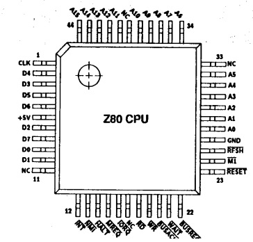
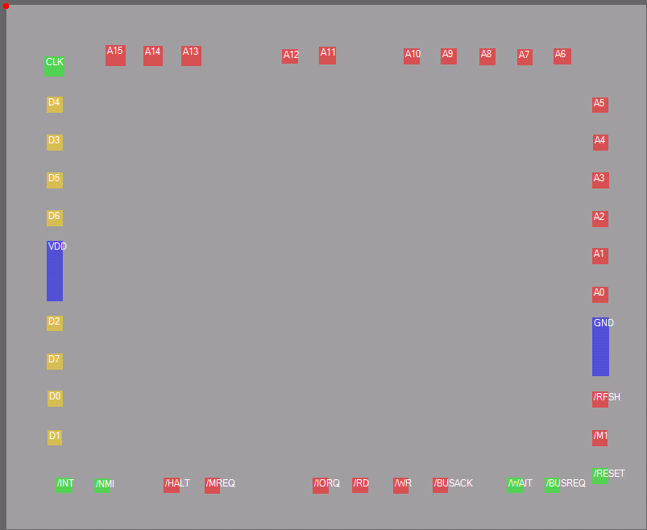
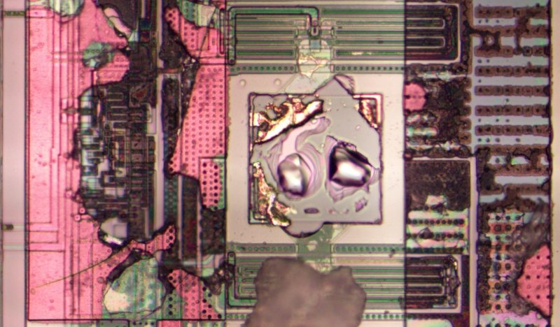
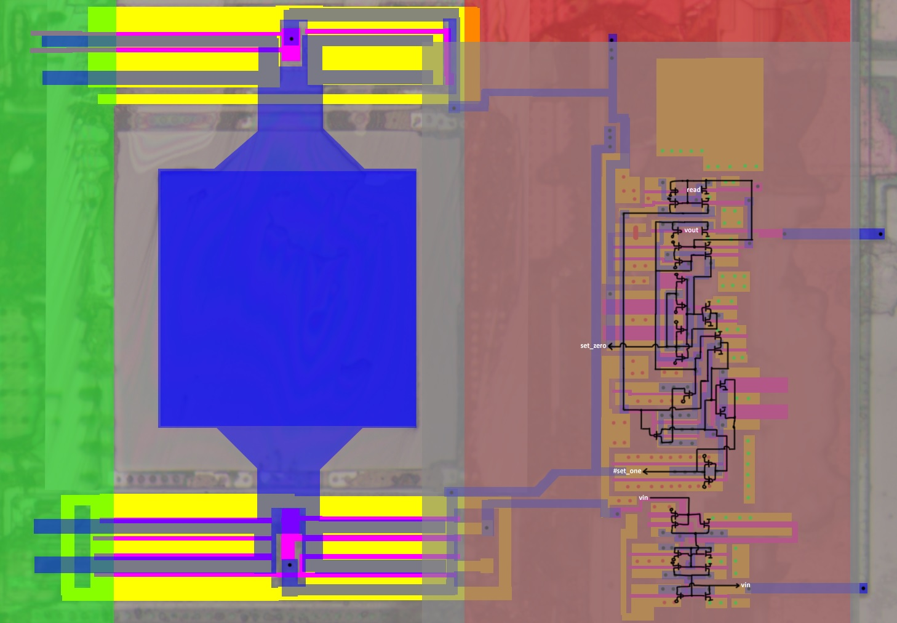
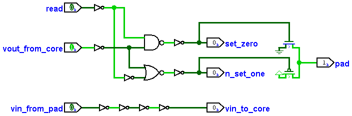

# Терминалы

Бондинг падов не очень соответствует пинам, но по типу падов можно определить порядок.

# Терминалы Input

# Терминалы Inout/Output

Судя по всему для `inout` и `output` используется одинаковая схема.

|||
|---|---|

Контактная площадка очень плохо разбираема на фото, но в целом как она работает понятно. Транзистор справа вверху скорее всего подсоединен к GND и формирует защитный диод (ESD).
