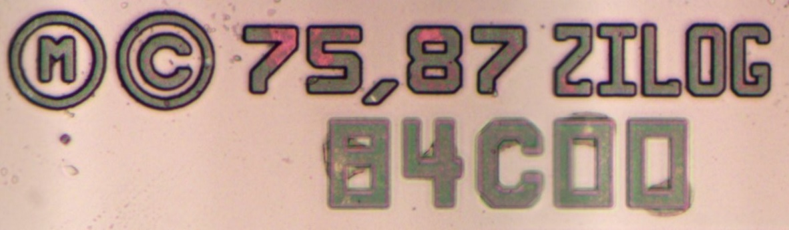
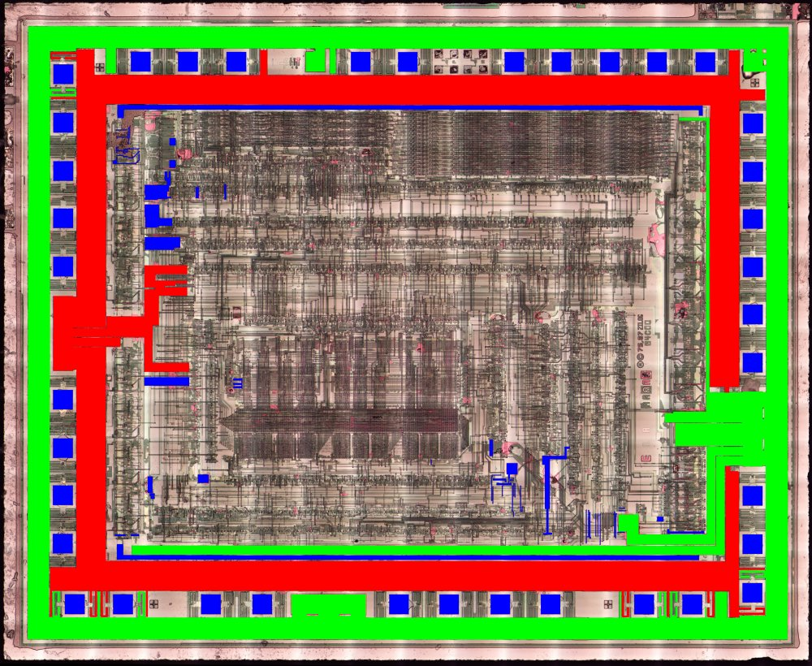
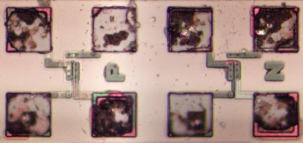

# Заметки по топологии

- CMOS
- 2 слоя металла, Алюминий
- Соединения M2 необычно "пухленькие"
- Поли-соединения также пристутствуют и достаточно разветвленные
- Кастомные блоки для декодирования, АЛУ и интерфейса с шинами Data/Addr
- Логика на стандартных (или типа) ячейках
- P-карманы

# Карманы

Карманы P-типа (спасибо за подсказку).

